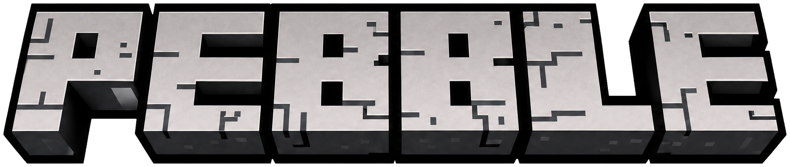

<p align="center">
  
</p>

<h3 align="center">The open-source alternative to Minecraft: Java Edition.</h3>

<p align="center">
  <em>A complete block-survival game, built from scratch in Swift + Metal.<br>
  Every sound synthesized in real time. Every chunk carved from noise.</em>
</p>

<p align="center">
  
</p>

---

**Pebble** is the open-source alternative to Minecraft: Java Edition — a native macOS voxel survival game with the full overworld/nether/end progression: worldgen, mobs, redstone, crafting, enchanting, brewing, villages, raids, and boss fights — implemented in **~45,000 lines of Swift** with **zero external dependencies**. No game engine, no .xcodeproj. The renderer is hand-written Metal, the audio engine synthesizes every sound from oscillators at runtime, and the game looks the way it does thanks to [Faithful 32x](https://faithfulpack.net) as its built-in texture set.

Pebble is an original fan re-creation inspired by Minecraft: Java Edition 1.20. It is **not affiliated with, endorsed by, or connected to Mojang Studios or Microsoft** in any way, and contains no Mojang code or assets. Full statement in [Disclaimer](#disclaimer) below.

> **Pebble 1.0.0 is a beta.** The engine is pinned by 456 golden regression checks, but a game of this scope absolutely has bugs we haven't found yet — we just don't know where they are. If you hit one, [opening an issue](https://github.com/thebriangao/pebble/issues) would mean the world to us, and a pull request with a fix even more. See [Reporting bugs & contributing](#reporting-bugs--contributing) for what to include.

## By the numbers

| | |
|---|---|
| Lines of Swift | ~45,000 across 82 files |
| External dependencies | **0** (Apple frameworks only) |
| Blocks | 879 |
| Items | 1,188 |
| Biomes | 63 (overworld, nether, end, cave biomes) |
| Entity types | 100 (55+ mobs with full AI, vehicles, projectiles) |
| Structures | 19 types, 30+ variants (villages, strongholds, bastions, end cities, ancient cities…) |
| Golden regression checks | 456, all green (`pebble test`) |
| Renderer | Metal, 15+ passes, runtime-compiled MSL |
| Textures | [Faithful 32x](https://faithfulpack.net) by the Faithful team (third-party, fully credited) |
| Audio assets | 0 — fully synthesized (AVAudioSourceNode + biquad filters) |
| Performance | 200+ fps at full fancy settings on an Apple-silicon MacBook Air |
| World load | ~2–4 s cold |

## Features

- **Full survival loop** — mining with tool tiers, hunger/saturation, XP, sleeping, fall damage, drowning, fire, status effects, death messages, respawn/keep-inventory game rules.
- **Worldgen** — multi-noise climate sampling (temperature/humidity/continentalness/erosion/weirdness) through spline-driven terrain, 3D density caves (cheese/spaghetti/noodle), ravines, aquifers, ore distribution per vanilla 1.20 tables, snow lines, and 63 biomes including lush caves, dripstone caves, and the deep dark.
- **Three dimensions** — overworld, nether (fortresses, bastions, all five nether biomes), and the end (dragon fight, end cities, gateways), connected by working portals.
- **Structures** — villages with professioned villagers and working trades, strongholds with the portal room, mineshafts, desert/jungle temples, igloos with basements, witch huts, ocean monuments and ruins, shipwrecks, buried treasure, ruined portals, woodland mansions, amethyst geodes, ancient cities with sculk and shriekers.
- **Mobs & AI** — 55+ mobs with A* pathfinding, goal-based AI (breeding, taming, fleeing, pack hunting), villager gossip and trades, piglin bartering, raids with waves and Hero of the Village, and the three bosses: Ender Dragon, Wither, Warden (with vibration detection).
- **Redstone** — wire networks with 0–15 power levels, repeaters with locking, comparators that read containers, pistons with quasi-connectivity and slime/honey push sets, observers, dispensers, hoppers, rails, sculk sensors.
- **Items & systems** — shaped/shapeless/tag crafting, smelting in three furnace types, brewing, enchanting with 39 enchantments and a compatibility matrix, anvils, grindstones, smithing with armor trims, stonecutters, loot tables with fortune/looting, fishing, archaeology with sherds and decorated pots, advancements.
- **Vanilla-exact player physics** — walk 4.317 b/s, sprint 5.612 b/s, jump apex 1.2522 blocks, sprint-jumping, water/lava/elytra movement, ice slipperiness, soul sand, honey — verified by independent-derivation tests in the suite.
- **Faithful 32x textures, built in** — the complete [Faithful 32x](https://faithfulpack.net) art (third-party, fully credited — see [Disclaimer](#disclaimer)) ships inside the app and loads through Pebble's own zip/`.mcmeta` reader: atlas textures, animations with interpolation, GUIs, fonts, entity skins, and sun/moon art. Self-restoring if the file goes missing.
- **Ultra graphics** — a built-in enhanced pipeline: SSAO, shadow-marched volumetric god rays, Poisson soft shadows, and ACES tonemapping. One toggle in Options → Video.
- **Generative music** — no audio files anywhere; ambient music, jukebox discs, and all ~hundreds of sound effects are synthesized from oscillator/noise recipes with envelopes, vibrato, positional stereo, underwater lowpass, and cave reverb.

## Install

Requirements: **macOS 14+** and the Xcode command-line tools (`xcode-select --install`). Apple silicon recommended.

```bash
git clone https://github.com/thebriangao/pebble.git && cd pebble
./pebble install
```

That builds in release mode, assembles a signed `Pebble.app`, installs it to `~/Applications`, and links the `pebble` CLI onto your PATH.

```
./pebble install    build from source and install ~/Applications/Pebble.app
pebble update       pull the latest version, rebuild, swap the live app
pebble run          launch Pebble
pebble test         run the 456-check golden test suite
```

For development you can also run straight from the checkout — `swift run -c release Pebble` — and the app will find its packaged assets in `packaging/`.

## Controls

WASD to move, mouse to look, Space to jump, Shift to sneak, Ctrl (or double-tap forward) to sprint, E for inventory, Esc to pause. F1 hides the GUI, F3 toggles the debug overlay, F11 toggles fullscreen (also in Options → Video). Scroll the hotbar with the wheel or trackpad. Everything is rebindable in Options → Controls.

## Where things live

| Path | What |
|---|---|
| `~/Library/Application Support/Pebble/pebble.db` | All worlds, chunks, players, advancements (single SQLite database) |
| `~/Library/Application Support/Pebble/settings.json` + `keybinds.json` | Settings and keybinds |

To uninstall completely: delete `~/Applications/Pebble.app`, `~/Library/Application Support/Pebble/`, and the `pebble` symlink on your PATH (`/opt/homebrew/bin/pebble` or `/usr/local/bin/pebble`).

## Project layout

```
Sources/PebbleCore/   the engine — headless, no AppKit, fully testable
  Core/               deterministic math: fdlibm trig, seeded RNG, simplex noise
  World/              chunks, block registry (879), light engine, block entities
  Gen/                terrain, biomes, features, all structures
  Entity/             100 entity types, AI, pathfinding, player physics
  Items/              item registry (1,188), recipes, enchants, potions, loot
  Systems/            interact, redstone, fluids, farming, combat, raids, portals
  Render/             section mesher, texture atlas, entity models
  Game/               GameCore tick orchestrator, SQLite saves, settings
Sources/Pebble/       the macOS app — window, Metal renderer, UI, audio, input
Sources/pebsmoke/     golden test harness (456 checks against goldens/*.json)
goldens/              golden baseline files pinning engine behavior
packaging/            Info.plist, icon, logo, title art, bundled Faithful textures
pebble                the build/install/test CLI
```

A deeper tour lives in [ARCHITECTURE.md](ARCHITECTURE.md).

## The determinism contract

Pebble's engine is **fully deterministic**: a portable fdlibm implementation of `sin/cos/atan2` (pure IEEE-754 operations, no platform math library), 32-bit-wrapping integer hashes, and seeded RNG everywhere mean the same seed produces the identical world — bit for bit, on any machine, across releases. That contract is enforced by golden baseline files: `pebble test` runs 456 checks covering terrain hashes over full chunk pipelines, a 55-mob zoo ticked 200 steps and compared at checkpoints, 911 transcendental-math probes, recipe/enchant/loot RNG lockstep, a redstone contraption timeline, and independent derivations of vanilla physics constants. The goldens are the contract that keeps the engine honest — a change that moves a single block in an existing world fails the suite.

## Development hooks

Useful environment variables for testing and automation:

| Variable | Effect |
|---|---|
| `PEBBLE_AUTOLOAD=1` | skip menus, load the most recent world |
| `PEBBLE_NEWWORLD=<seed>` | create a fresh world with that seed (worldgen testing) |
| `PEBBLE_CMD="/tp 0 120 0;/time set 1000"` | run chat commands once the world is up |
| `PEBBLE_SHOT="/tmp/x.png@300"` | capture a frame N frames after load |
| `PEBBLE_WORLDS=1` | jump straight to the world-select screen |
| `PEBBLE_BOT=1` | run the physics validation bot through the real input path |
| `PEBBLE_PHOTOBOOTH=1` | studio rig that captures every mob and block to PNGs (`PEBBLE_BOOTH_MOBS=cow,sheep` / `PEBBLE_BOOTH_BLOCKS=-` to filter) |
| `PEBBLE_PROF=1` | print per-stage load/tick timings |
| `PEBBLE_PACKDEBUG=1` | log texture tile coverage and entity-skin resolution |
| `PEBBLE_GEOM_DEBUG=1` | log entity geometry construction |
| `PEBBLE_REGOLD=1` | **rewrites golden baselines** — see CONTRIBUTING before using |

## Reporting bugs & contributing

**Contribution is incredibly welcome.** This is a first public beta: the engine is golden-tested, but the bug list is unknown by definition — the bugs are out there, and you will find them before we do. Every report genuinely helps.

Found a bug? [Open an issue](https://github.com/thebriangao/pebble/issues). To help us identify and fix it, please include:

- **macOS version and Mac model/chip** — e.g. "macOS 15.2, M2 MacBook Air".
- **Pebble version** — bottom-left of the title screen.
- **What you did, what happened, what you expected** — rough steps to reproduce are fine.
- **World context** if it's an in-world bug: the **seed**, the **dimension**, and your **coordinates** (the F3 overlay shows all three).
- **Settings that matter**: render distance and whether ultra graphics are on.
- **Screenshots or video** for anything visual.
- For crashes: the crash report from `~/Library/Logs/DiagnosticReports`, and terminal output if you launched with `pebble run` from a terminal.
- If the engine itself seems wrong (worldgen, physics, redstone): the tail of `pebble test` — it should print `456 passed, 0 failed`.

Even better than a bug report is a **pull request with a fix** — see [CONTRIBUTING.md](CONTRIBUTING.md) for the build/test workflow and the conventions that are load-bearing (registration order, RNG discipline, determinism rules). PRs of all sizes are wanted, from typo fixes to subsystem work.

- [CONTRIBUTING.md](CONTRIBUTING.md) — build, test, golden workflow, load-bearing conventions.
- [SECURITY.md](SECURITY.md) — threat model and how to report vulnerabilities privately. Pebble makes **zero network connections** and collects nothing.
- [LICENSE](LICENSE) — MIT, covering the code in this repository. The bundled Faithful artwork is third-party content under its own terms.
- [CHANGELOG.md](CHANGELOG.md) — release history.

## Disclaimer

**Pebble is an independent, original fan re-creation. It is not an official Minecraft product. It is not affiliated with, endorsed by, sponsored by, or connected to Mojang Studios, Microsoft Corporation, or any of their subsidiaries, in any way.** "Minecraft" is a trademark of Mojang Synergies AB / Microsoft; Pebble does not use the name in the software and claims no association with the trademark holders.

Pebble's *gameplay design* is inspired by Minecraft: Java Edition 1.20 — game rules and mechanics reimplemented from publicly observable gameplay. Concretely:

- **No Mojang/Microsoft source code is used.** Every line of game code was written for this project by its author — the sole third-party-derived code is the fdlibm trigonometry port in `Sources/PebbleCore/Core/DetMath.swift` (Sun Microsystems' permissive license, notice preserved there). Nothing is decompiled, disassembled, copied, or derived from Minecraft's code.
- **No Mojang/Microsoft asset files are included.** The engine's texture atlas is generated by code; the default visual layer is the third-party Faithful 32x pack (credited below — the Faithful team's own artwork); sounds and music are synthesized in real time from oscillator recipes; fonts are a built-in bitmap glyph set; entity models are hand-written Swift reproducing the vanilla mobs' publicly documented box dimensions and UV layouts — required for Java Edition-format entity textures to map onto them correctly. There are no extracted game files anywhere in this repository.
- Pebble is free, open-source, non-commercial, **singleplayer only**, and connects to nothing.

**Third-party content:** the app bundle ships the complete, unmodified [Faithful 32x](https://faithfulpack.net) (1.20.1) as its built-in texture set. That artwork is the work of the Faithful team and its contributors, distributed under the [Faithful License](packaging/FAITHFUL-LICENSE.txt) (included verbatim here and in the app bundle, as it requires) — it is **not** covered by this repository's MIT license. Pebble is free and non-commercial, consistent with that license's no-monetization requirement. If anyone with rights in that artwork prefers it not be bundled, contact the address below and it will be removed promptly; Pebble remains fully functional without it. Pebble's ability to *read* the file format the artwork ships in is an independently implemented compatibility feature and implies no affiliation.

Pebble is provided "as is", without warranty of any kind (see [LICENSE](LICENSE)). It writes only to `~/Library/Application Support/Pebble/` and `~/Applications/Pebble.app`. Questions, concerns, or good-faith takedown requests from rights holders: **briangaoo2@gmail.com** (subject starting with `[pebble]`) — they will be honored quickly.

---

<p align="center"><em>Singleplayer, for now.</em></p>
